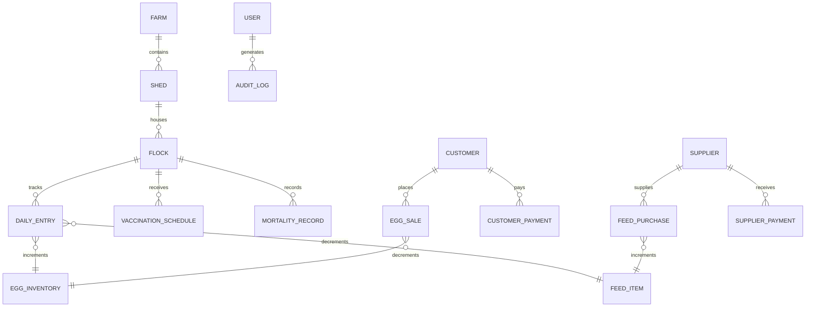

# ডাটাবেস ডিজাইন ও স্কিমা আর্কিটেকচার (DATABASE_DESIGN.md)

**পোল্ট্রি ফার্ম ম্যানেজার** ডাটাবেসটি MongoDB Atlas ও Mongoose ওআরএম ব্যবহার করে তৈরি। এতে উচ্চ কার্যক্ষমতাসম্পন্ন ইনডেক্সিং, রেফারেন্সিয়াল রিলেশন এবং ডেটা ইন্টিগ্রিটি নিশ্চিত করা হয়েছে।

---

## ১. এন্টিটি রিলেশনশিপ ডায়াগ্রাম (Entity Relationships)

---

## ২. মূল কালেকশন ও স্কিমাসমূহ (Mongoose Models)

| মডেলের নাম | ফাইলের অবস্থান | প্রধান ফিল্ডসমূহ | ইনডেক্স ও কনস্ট্রেইন্ট |
|---|---|---|---|
| `User` | `src/models/User.ts` | uid, email, displayName, role, isActive | `uid: 1 (unique)`, `email: 1 (unique)` |
| `Setting` | `src/models/Setting.ts` | farmName, ownerName, phone, traySize, alert thresholds | Single-tenant document |
| `Shed` | `src/models/Shed.ts` | name, code, capacity, currentOccupancy, type, status | `code: 1 (unique)` |
| `Flock` | `src/models/Flock.ts` | batchId, name, breed, arrivalDate, initialBirdCount, currentBirdCount, shedId | `batchId: 1 (unique)`, `shedId: 1` |
| `DailyEntry` | `src/models/DailyEntry.ts` | date, shedId, flockId, totalEggs, goodEggs, feedConsumedKg, mortalityCount, closingBirdCount | **Compound Unique**: `{ flockId: 1, date: 1 }` |
| `EggInventory` | `src/models/EggInventory.ts`| totalPieces, goodPieces, brokenPieces, dirtyPieces | Central inventory document |
| `Customer` | `src/models/Customer.ts` | name, phone, openingBalance, currentDue, totalPurchases, totalPaid | `phone: 1 (index)` |
| `EggSale` | `src/models/EggSale.ts` | invoiceNo, customerId, date, unitType, quantityInUnit, grandTotal, paidAmount, dueAmount | `invoiceNo: 1 (unique)`, `customerId: 1`, `date: 1` |
| `CustomerPayment`| `src/models/CustomerPayment.ts`| receiptNo, customerId, date, amount, paymentMethod | `receiptNo: 1 (unique)`, `customerId: 1` |
| `FeedItem` | `src/models/FeedItem.ts` | name, type, brand, unit, bagWeightKg, currentStockKg, lowStockThresholdKg | `name: 1` |
| `FeedPurchase` | `src/models/FeedPurchase.ts`| invoiceNo, supplierId, feedItemId, bagCount, totalKg, totalCost, paidAmount, dueAmount | `invoiceNo: 1 (unique)`, `supplierId: 1` |
| `Supplier` | `src/models/Supplier.ts` | name, companyName, phone, category, currentPayable, totalPurchases | `phone: 1 (index)` |
| `SupplierPayment`| `src/models/SupplierPayment.ts`| voucherNo, supplierId, date, amount, paymentMethod | `voucherNo: 1 (unique)` |
| `Medicine` | `src/models/Medicine.ts` | name, type, brand, unit, currentStock, lowStockThreshold, expiryDate | Stock collection |
| `VaccinationSchedule`| `src/models/VaccinationSchedule.ts`| flockId, vaccineName, targetBirdAgeWeeks, scheduledDate, status | `flockId: 1`, `scheduledDate: 1` |
| `MortalityRecord`| `src/models/MortalityRecord.ts`| date, flockId, deadCount, suspectedReason | `flockId: 1`, `date: 1` |
| `Expense` | `src/models/Expense.ts` | date, category, description, amount, paymentMethod | `date: 1`, `category: 1` |
| `Income` | `src/models/Income.ts` | date, source, description, amount, paymentMethod | `date: 1`, `source: 1` |
| `Employee` | `src/models/Employee.ts` | name, phone, role, monthlySalary, status | Payroll collection |
| `AuditLog` | `src/models/AuditLog.ts` | userUid, userName, userRole, action, module, details, timestamp | `timestamp: -1` |
| `Notification`| `src/models/Notification.ts`| title, message, type, isRead, link | `isRead: 1`, `createdAt: -1` |

---

## ৩. ডেটা ইন্টিগ্রিটি ও স্বয়ংক্রিয় নিয়মাবলী (Data Integrity Rules)

1. **ডিম উৎপাদন থেকে ইনভেন্টরি বৃদ্ধি**:
   - `DailyEntry` তৈরির সময় `goodEggs` সংখ্যাটি সরাসরি `EggInventory.goodPieces` এ যোগ হয়।
2. **ডিম বিক্রয় থেকে ইনভেন্টরি হ্রাস**:
   - `EggSale` চালানের মোট ডিম সংখ্যা ইনভেন্টরি থেকে বিয়োগ হয়। পর্যাপ্ত স্টক না থাকলে চালান কাটার চেষ্টা ব্লক করা হয়।
3. **খাদ্য খরচ ও ক্রয় সমন্বয়**:
   - দৈনিক খাদ্য এন্ট্রি সংশ্লিষ্ট ফিড আইটেমের স্টক থেকে হ্রাস পায়।
   - খাদ্য ক্রয়ের চালান সংরক্ষণ করলে স্টক বৃদ্ধি পায় এবং সরবরাহকারীর দেনা বৃদ্ধি পায়।
4. **মৃত্যুহার থেকে ফ্লক সমন্বয়**:
   - দৈনিক মৃত্যু ও বাতিল মুরগি রেকর্ড করার সাথে সাথে সংশ্লিষ্ট ফ্লকের `currentBirdCount` এবং শেডের অকুপেন্সি আপডেট হয়।
5. **ডুপ্লিকেট এন্ট্রি প্রতিরোধ**:
   - একই ফ্লকে একই তারিখে একাধিক দৈনিক এন্ট্রি প্রতিরোধে `{ flockId: 1, date: 1 }` কম্পাউন্ড ইউনিক ইনডেক্স কার্যকর রয়েছে।
